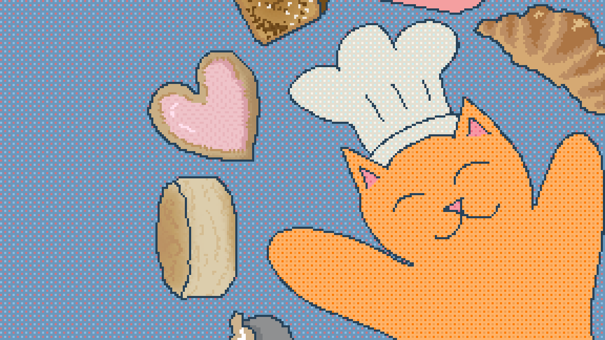

# Biscuit Factory

A cozy factory-automation game about running a bakery staffed entirely by
adorable cats. **The cats are the automation** — there are no conveyor
belts. Delivery Cats carry ingredients and finished goods between
buildings, and station cats operate the mixers, ovens, and other
equipment. Your job is to lay out the factory, assign roles, and keep
everyone fed and working efficiently.

No enemies, no time pressure, no fail state — just a growing bakery, a
growing crew of cats, and the satisfaction of a well-organized floor
plan.

## Gameplay

Place stations → cats staff and supply them → watch cats work → sell
desserts → earn money → expand the factory → optimize the layout
(shorter walks, fewer bottlenecks) → unlock better recipes.

- **Grid-based building placement** across an expandable factory floor
- **Delivery Cats** that automatically haul ingredients and goods
  between buildings, prioritizing nearby and long-starved jobs
- **Station Cats** (Mixer / Oven / Cutter / Assembler) that staff and
  run processing buildings
- A full **recipe and tier-progression system**, from a single Whipped
  Cream recipe up through a multi-station dessert lineup
- Adopt, name, and reassign cats; pick them up and move them anywhere
- A cinematic ending sequence with a bakery report, employee awards, and
  rolling credits over your still-running factory

## Built with

[Godot 4.7](https://godotengine.org), built on top of
[Maaack's Godot Game Template](https://github.com/Maaack/Godot-Game-Template)
for menus, settings, and save-slot infrastructure. See
[ATTRIBUTION.md](ATTRIBUTION.md) for the full credits and asset licenses.

## Development docs

The `.context/` folder holds this project's living design and
architecture docs (vision, gameplay systems, progression tuning,
architecture notes, and a dated decision log) — the source of truth for
how and why the game is built the way it is.

## License

This project's original code and assets are **all rights reserved**
unless noted otherwise. Third-party components (the Godot Game Template
and other bundled assets) keep their own licenses — see
[ATTRIBUTION.md](ATTRIBUTION.md).

## Credits

**Made by**
- Peyton Thibodeaux — Game Programming, Music
- Lauren Thibodeaux — Art, Animation

Full credits, including the Godot Game Template and other third-party
assets, are in [ATTRIBUTION.md](ATTRIBUTION.md).
